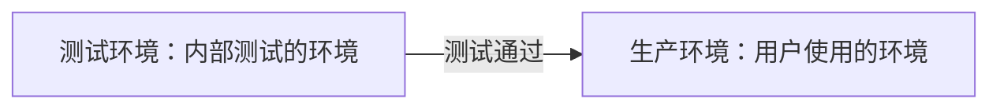

# 软件测试流程

## 原则

1. 一切追溯到用户的需求
2. 应该把"尽早测试和不断测试"作为测试人员的座右铭
3. 二八原则：80%的错误，发生在 20%的模块中
4. 穷举测试是不可能的
5. 第三方测试会更客观
6. 测试用例是设计出来的，不是写出来的
7. 不可将测试用例置之度外，排除随意性
8. 测试贯穿于整个生命周期
9. 对发现错误较多的程序段，应进行更深入的测试
10. 妥善保存一切文档，便于后期进行复用

## 基本流程（重要）

产品经理和客户对接，将客户的需求转换产品需求（需求文档和产品原型图），产品将需求文档发给项目组各个成员，我对文档进行研读。开需求评审会议，产品阐述需求，项目成员理解需求，提出问题，去除歧义。会议后，由测试老大编写测试计划，测试计划评审会（测试，项目经理）。编写测试用例，测试用例评审会议（测试，项目经理，开发）。等待开发提测。如果是前后端分离的项目首先测试接口。产品功能测试，首先进行冒烟测试，系统测试（功能，非功能，ui，易用性，兼容性，网络，性能，安全）。如果发现问题，我们会提交问题给开发，开发修复好之后我们会进行功能回归测试，2-3 轮系统回归测试，如果时间充足，我们还会进行交叉测试。我们输出测试时报告，给出是否上线结论。运维上线。

### 需求分析阶段

越多需求，理解需求，分析需求，参加需求评审会议

### 测试计划阶段

编写测试计划，参与测试计划评审工作

### 测试设计阶段

参考需求文档、接口文档、详细设计编写测试用例，与开发、产品经理沟通

### 测试执行阶段

- 搭建测试环境，准备数据，执行冒烟测试，进入正式测试，提交 bug

### 评估阶段

出测试报告，对整个测试过程进行评估

## Bug 处理流程

发现问题，提交到缺陷管理平台，督促开发确认和解决，开发确认并修复后，对缺陷进行回归验证，如果验证通过，关闭 bug，如果验证失败，开启 bug，协助开发修复 bug。

## 软件测试开始结束挂起测试的标准

开发提测后，冒烟测试通过后可以开始测试
出现致命问题，导致 30% 以上测试用例无法执行，一般很少出现这种情况，会挂起
开发修复完成，可执行进一步操作可以继续测试
测试用例 100% 执行, 软件产品的 bug 修复率在 95 以上, 并且不存在一般级别以上的 bug, 如果存在一般级别以上的 bug, 需要产品经理和项目经理协商, 由他们觉得是否可以上线
